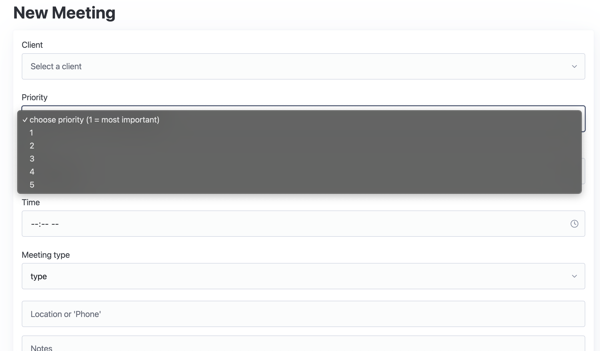
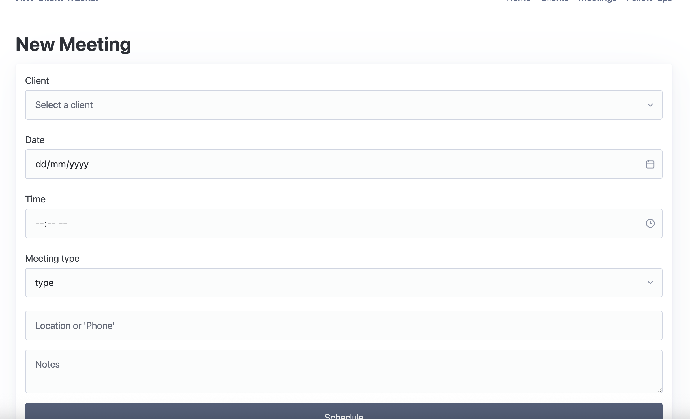
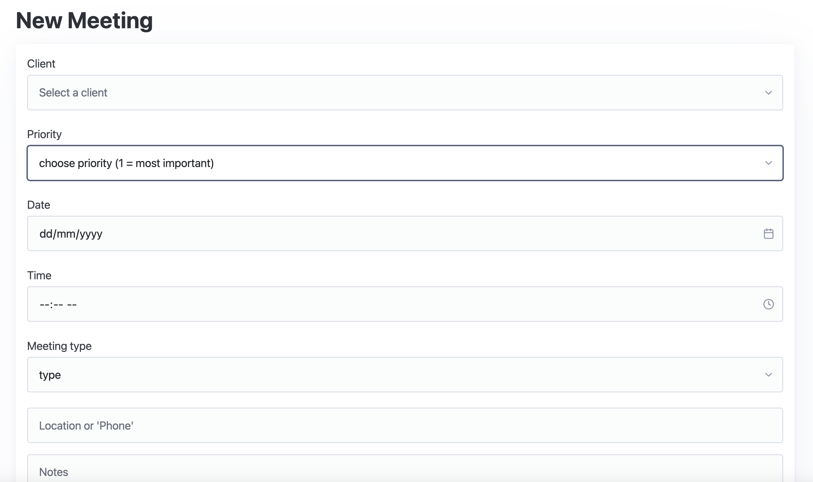

# Sprint 2 - A Minimum Viable Product (MVP)

## Sprint Goals

Develop a bare-bones, working web application that provides the key functionality of the system, then test and refine it so that it can serve as the basis for the final phase of development in Sprint 3.

---

## Implemented Database Schema

Replace this text with notes regarding the DB schema.

)

---

## Initial Implementation

The key functionality of the web app was implemented:

---

## Follow-up priority

My end user pointed out I didn't add the priority system which would warn a worker that someone is very important or that their due date is upcoming.

### Changes / Improvements

I works. 

---

## Sprint Review

The sprint achieved what I wanted: the app is now a working MVP that meets my users requirements. Near to everything that could've gone wrong, probably did. Other than that, everything went swimingly ;D

