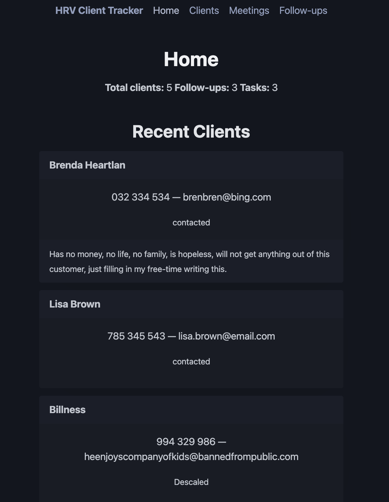
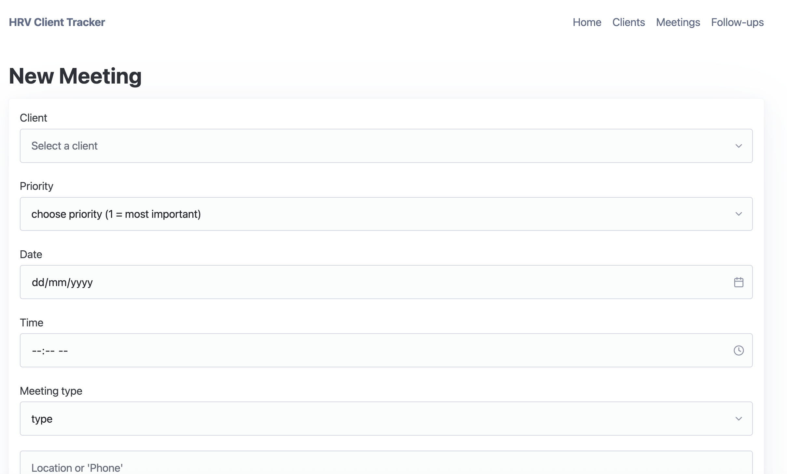
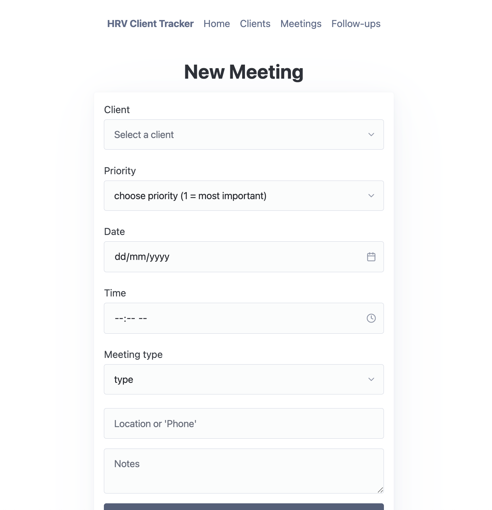
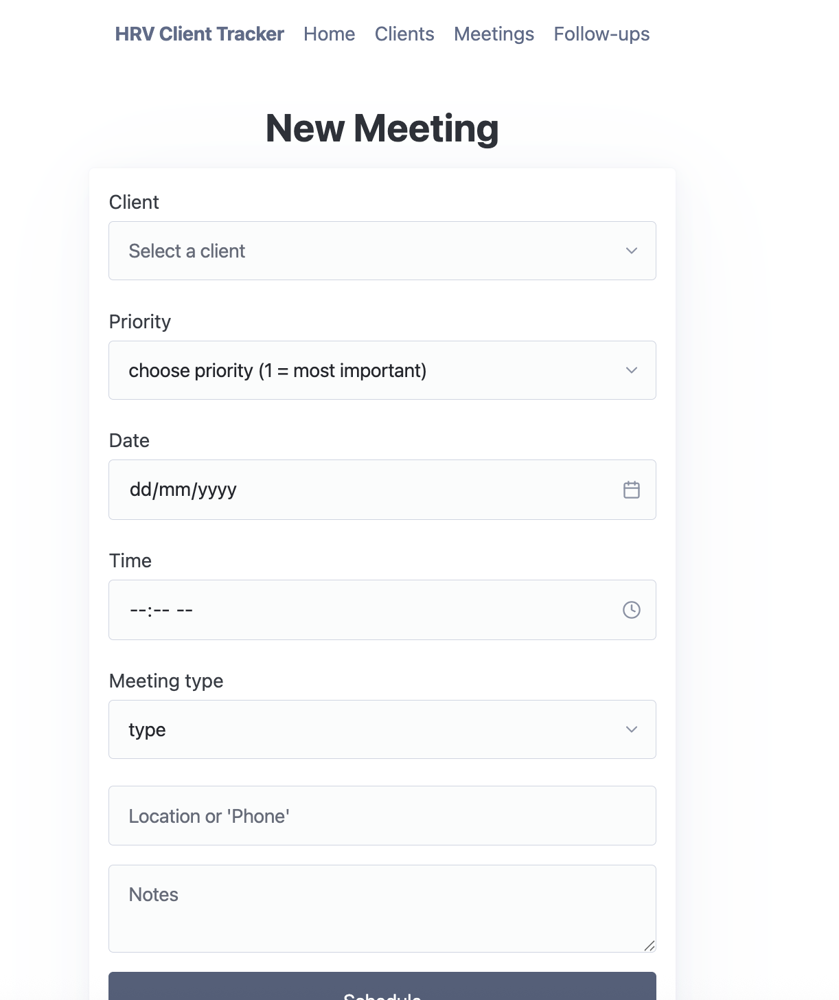
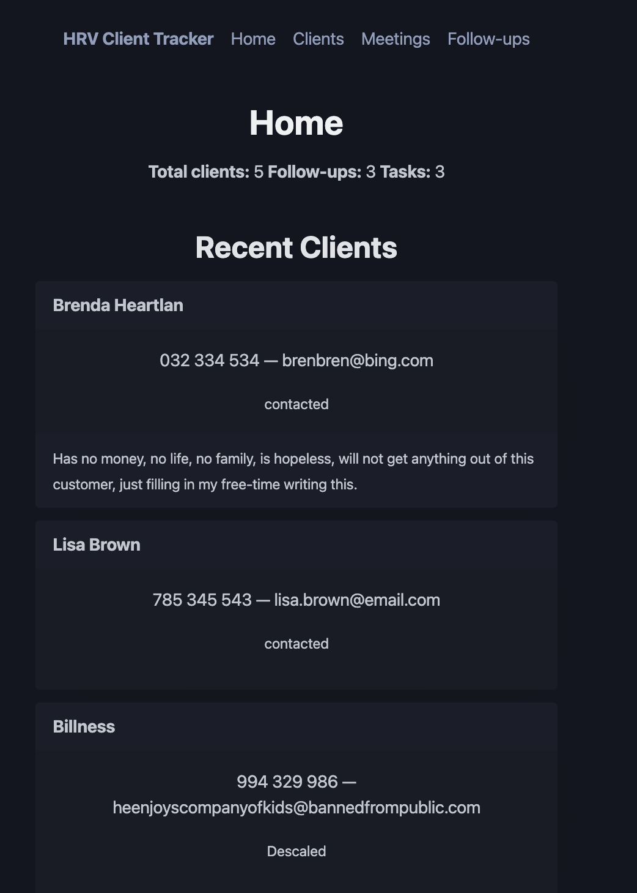

# Sprint 3 - A Refined and Complete System

## Sprint Goals

Develop the system until it is fully featured, with a refined UI and it satisfies the requirements. The system will be fully tested at this point.

---

## Final Implementation

The web app is fully implemented with a refined UI:

---

## Centering list

The webpage looked bizarrely scattered with the title being on the left and the page buttons being on the right and the bubble (as I call the pico cards) are annoyingly large.

### Changes / Improvements

Now the webpage looks more like a 'humble family' (do not ask what I mean by that; I don't even know. Though Id throw in some lore is all)

---

## Dark mode vs Light mode

My stakeholder mentioned that if this were his usual time of organization (around 11pm-12am) it would be painful to look at for long periods .: I recommended dark mode 

### Changes / Improvements

Dark mode makes the webpage easier to look at for longer periods

---

## Sprint Review

This sprint focused on refinements on centering the layout, and dark mode to improve usability for my stakeholder. Nothing went too wrong- only real issue was a bit of a back and forth in the styles.css where I was adjusting the wrong page and though nothing was happening. Otherwise everything else worked out. 

